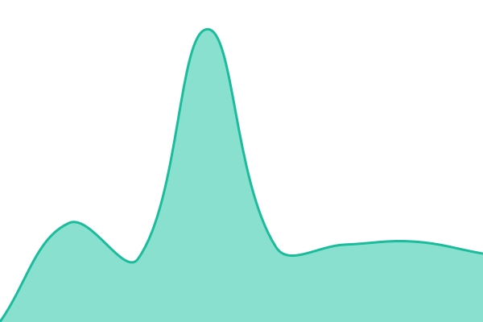

# [📈 Live Status](https://glm.yulecedar.com): <!--live status--> **🟩 All systems operational**

This repository contains the open-source uptime monitor and status page for ds sites

<!--start: status pages-->
<!-- This summary is generated by Upptime (https://github.com/upptime/upptime) -->
<!-- Do not edit this manually, your changes will be overwritten -->
<!-- prettier-ignore -->
| URL | Status | History | Response Time | Uptime |
| --- | ------ | ------- | ------------- | ------ |
|  [Family Life](https://jiatingshenghuo.com) | 🟩 Up | [family-life.yml](https://github.com/james-bltg/dssitesmonitor/commits/HEAD/history/family-life.yml) | 

 3268ms
     
 | 

<a href="https://james-bltg.github.io/dssitesmonitor/history/family-life">100.00%</a>
    

|  [I Love Grow](https://www.ilovegrow.com) | 🟩 Up | [i-love-grow.yml](https://github.com/james-bltg/dssitesmonitor/commits/HEAD/history/i-love-grow.yml) | 

 611ms
     
 | 

<a href="https://james-bltg.github.io/dssitesmonitor/history/i-love-grow">100.00%</a>
    

|  [Reader](https://cedarbook.biblestudy.top/landing) | 🟩 Up | [reader.yml](https://github.com/james-bltg/dssitesmonitor/commits/HEAD/history/reader.yml) | 

 1174ms
     
 | 

<a href="https://james-bltg.github.io/dssitesmonitor/history/reader">100.00%</a>
    

|  [Pei Wo Shuo](https://peiwoshuo.org) | 🟩 Up | [pei-wo-shuo.yml](https://github.com/james-bltg/dssitesmonitor/commits/HEAD/history/pei-wo-shuo.yml) | 

 1735ms
     
 | 

<a href="https://james-bltg.github.io/dssitesmonitor/history/pei-wo-shuo">100.00%</a>
    

|  [Ai Sheng Ming](https://aishengming.org) | 🟩 Up | [ai-sheng-ming.yml](https://github.com/james-bltg/dssitesmonitor/commits/HEAD/history/ai-sheng-ming.yml) | 

 1176ms
     
 | 

<a href="https://james-bltg.github.io/dssitesmonitor/history/ai-sheng-ming">100.00%</a>
    

|  [Jia You Zhong Guo](https://jiayouzhongguo.org) | 🟩 Up | [jia-you-zhong-guo.yml](https://github.com/james-bltg/dssitesmonitor/commits/HEAD/history/jia-you-zhong-guo.yml) | 

 436ms
     
 | 

<a href="https://james-bltg.github.io/dssitesmonitor/history/jia-you-zhong-guo">100.00%</a>
    

|  [Xin Sheng Ming](https://xinshengming.com) | 🟩 Up | [xin-sheng-ming.yml](https://github.com/james-bltg/dssitesmonitor/commits/HEAD/history/xin-sheng-ming.yml) | 

 639ms
     
 | 

<a href="https://james-bltg.github.io/dssitesmonitor/history/xin-sheng-ming">100.00%</a>
    

<!--end: status pages-->

[**Visit our status website →**](https://glm.yulecedar.com)

## 📄 License

- Powered by: [Upptime](https://github.com/upptime/upptime)
- Code: [MIT](./LICENSE) © [Anand Chowdhary](https://anandchowdhary.com), supported by [Pabio](https://pabio.com)
- Data in the `./history` directory: [Open Database License](https://opendatacommons.org/licenses/odbl/1-0/)
